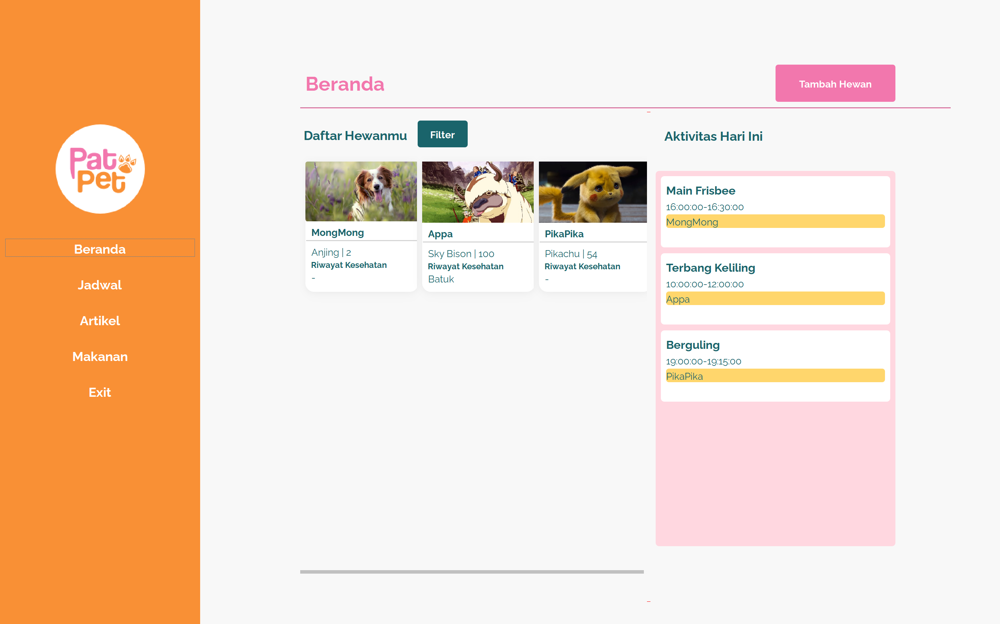
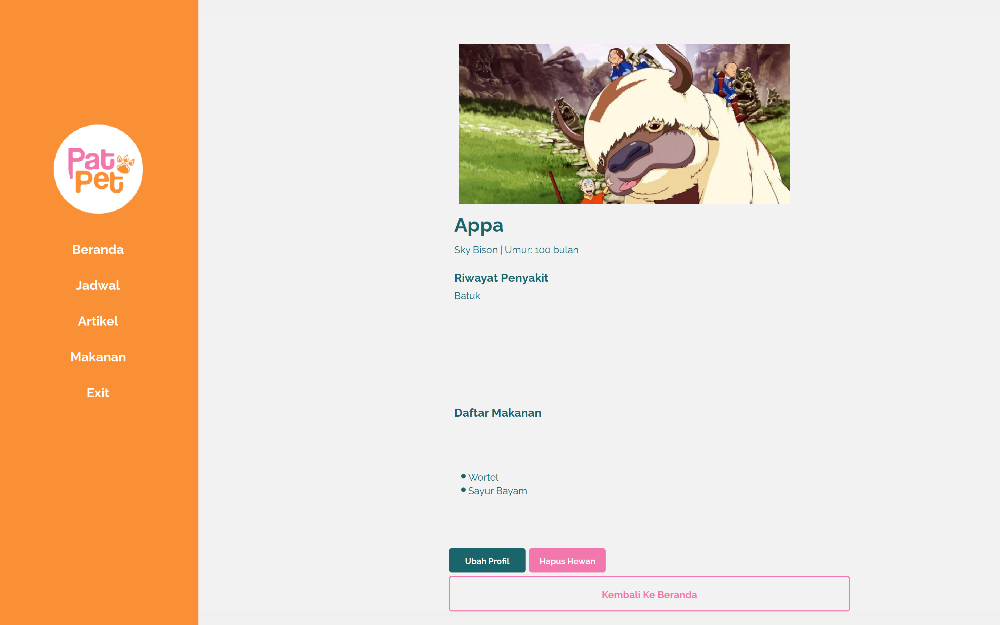
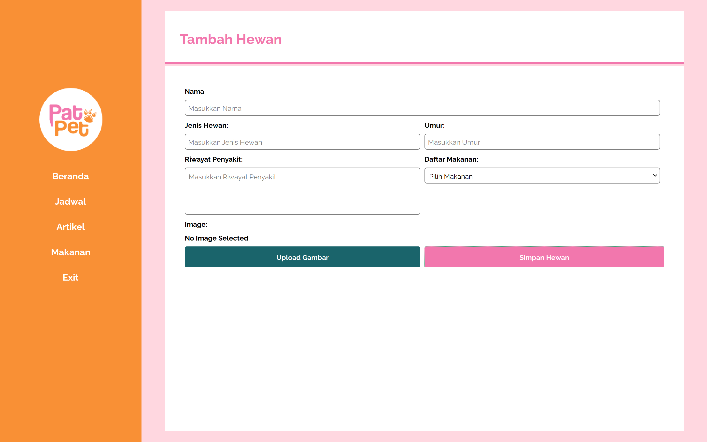
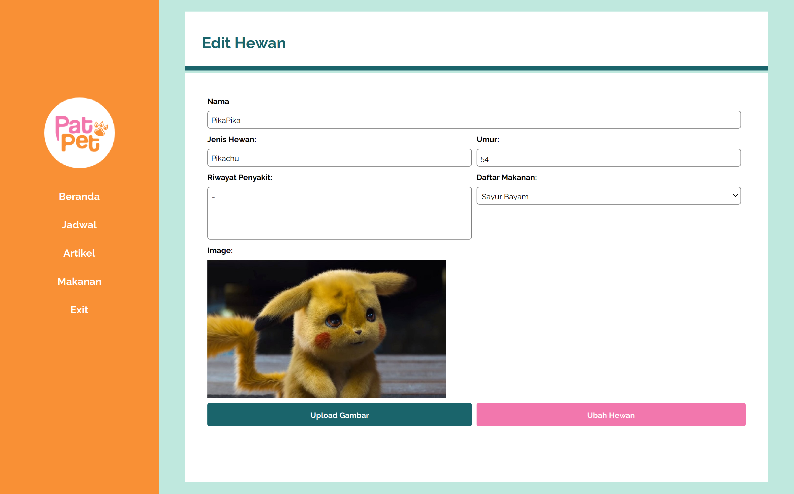
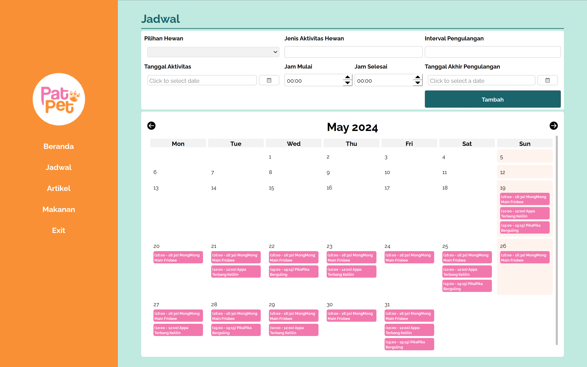
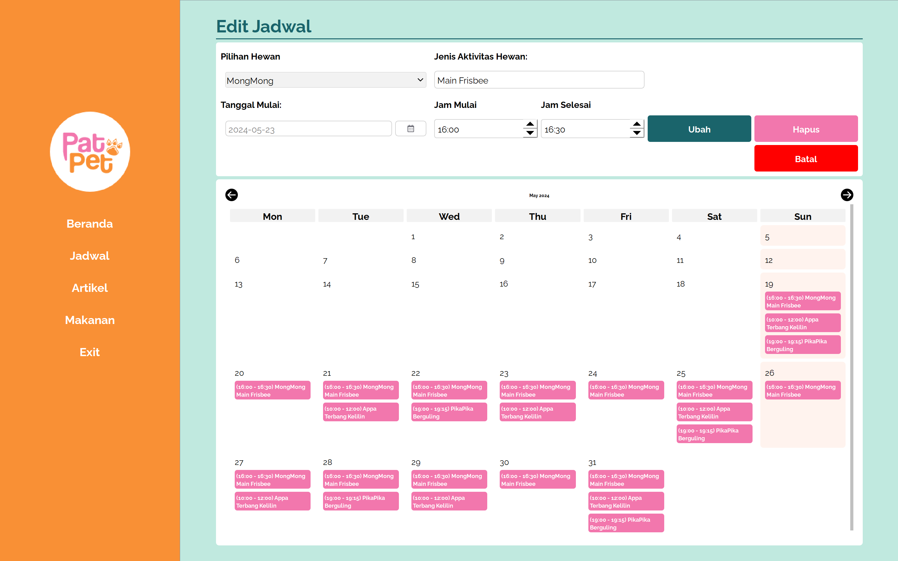
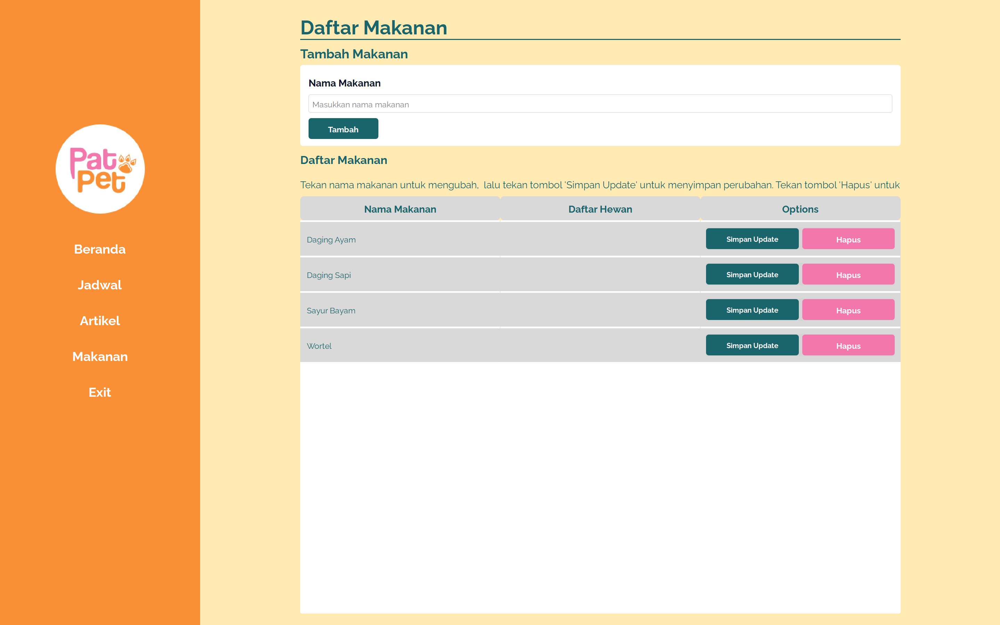
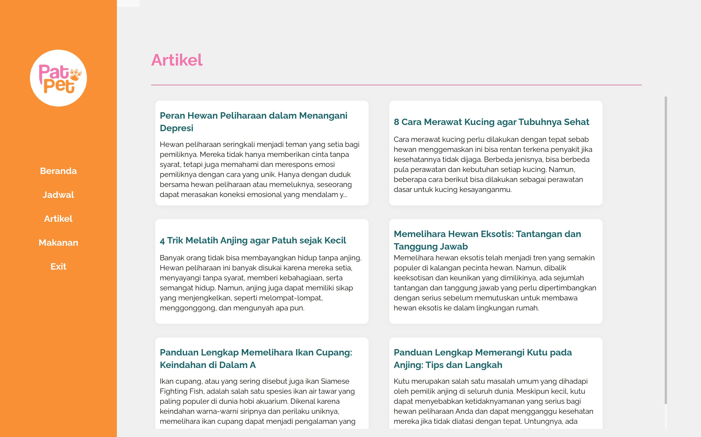
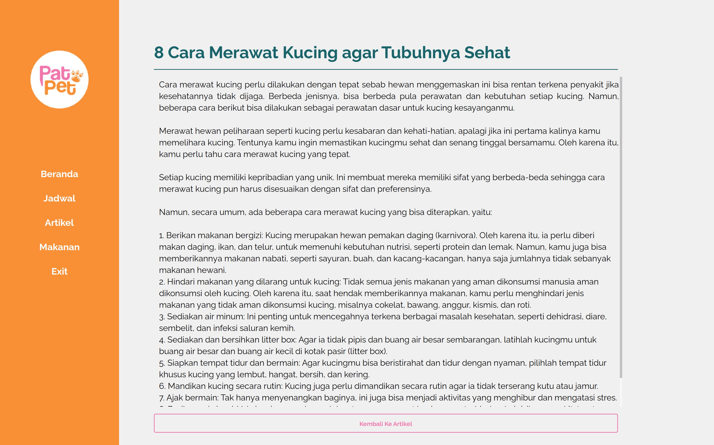
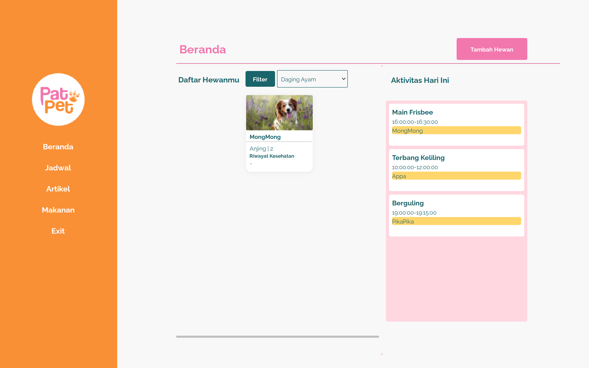

# IF2250-2024-K02-03-PatPet

## Overview


PatPet merupakan aplikasi untuk manajemen dan pemeliharan hewan peliharaan. PatPet dapat menampilkan profil dan biodata setiap hewan peliharaan yang dimiliki. Tidak hanya itu, pengguna juga dapat mencatat seluruh aktivitas hewan peliharaan yang dimiliki dan disajikan dalam bentuk kalendar. Tersedia juga artikel-artikel mengenai hewan dan cara pemeliharaannya.

## Prerequisites

- `Python` 3.X installed


## Setup

### Dependencies
Untuk melakukan instalasi terhadap library yang digunakan, ketik pada terminal perintah berikut:
```bash
pip install -r requirements.txt
```

### PyTest (Optional)

Untuk melakukan unit test, ketik pada terminal perintah berikut:
```bash
pytest
```


## Menjalankan Aplikasi


1. Pastikan seluruh dependencies telah di-install dan berada pada directory 'IF2250-2024-K02-03-PatPet'
2. Untuk menjalankan aplikasi, ketik pada terminal perintah berikut:

```bash
py src/main.py
```

## Daftar Modul

### Modul Pengolahan Hewan
Pengguna dapat melihat detail dari hewan yang dipeliharanya, termasuk menambah hewan peliharaan baru dan mengubah detail informasi dari hewan yang dipeliharanya.





### Modul Pengolahan Aktivitas
Pengguna dapat mencatat aktivitas hewan peliharaanya, termasuk jadwal kegiatan yang berulang. Pengguna dapat melihat catatan jadwalnya di dalam bentuk kalender, termasuk melihatnya di laman utama.




### Modul Pengolahan Makanan
Pengguna dapat mendaftarkan makanan baru yang dimakan oleh hewan peliharaannya. Pengguna juga dapat melihat hewan dengan makanan yang sama (pada tampilan filter).



### Modul Pengolahan Artikel
Pengguna dapat membaca artikel terkait dengan pemeliharaan hewan peliharaan.




### Modul Penampilan
Pengguna dapat melihat tampilan aplikasi secara umum terkait hewan peliharaan serta detail profil mereka, makanan, dan jadwal kegiatan hewan peliharaan.




## Struktur Database

### 1. Activity

| Field        | Type    | Null | Key | Default | Extra          |
| ------------ | ------- | ---- | --- | ------- | -------------- |
| activity_id  | INT     | NO   | PRI | NULL    | auto_increment |
| activity_name  | TEXT    | YES   |     | NULL    |
| activity_date      | DATE    | YES   |     | NULL    |
| start_time      | TIME    | YES  |     | NULL    |
| end_time | TIME    | YES   |     | NULL    |
| pet_id | INT    | YES   | MUL | NULL    | 

### 2. Articles

| Field         | Type    | Null | Key | Default | Extra          |
| ------------- | ------- | ---- | --- | ------- | -------------- |
| article_id    | INT | NO   | PRI | NULL    | auto_increment |
| title         | TEXT    | NO   |     | NULL    |
| content      | TEXT    | NO   |     | NULL    |

### 3. Foods

| Field        | Type    | Null | Key | Default | Extra                                               |
| ------------ | ------- | ---- | --- | ------- | --------------------------------------------------- |
| food_id      | INT | NO   | PRI | NULL    | auto_increment                                      |
| food_name        | TEXT    | NO   |     | NULL    |

### 4. Pet

| Field    | Type    | Null | Key | Default | Extra          |
| -------- | ------- | ---- | --- | ------- | -------------- |
| pet_id | INT | NO   | PRI | NULL    | auto_increment |
| pet_name     | TEXT    | NO   |     | NULL    |
| species     | TEXT    | NO   |     | NULL    |
| age     | INT    | NO   |     | NULL    |
| medical_record     | TEXT    | NO   |     | NULL    |
| image     | BLOB    | NO   |     | NULL    |

### 5. Pet Food

| Field     | Type    | Null | Key | Default | Extra                        |
| --------- | ------- | ---- | --- | ------- | ---------------------------- |
| pet_food_id | INT  | NO   | PRI | NULL    | auto_increment|
| pet_id  | INT | YES   | MUL | NULL    |   |
| food_id  | INT | YES   | MUL | NULL    |   |

## Authors & Contributions

### Authors

| NIM      | Name                          | GitHub                                              |
| -------- | ----------------------------- | --------------------------------------------------- |
| 13522042 | Amalia Putri                  | [amaliap21](https://github.com/amaliap21)           |
| 13522048 | Angelica Kierra Ninta Gurning | [angiekierra](https://github.com/angiekierra)       |
| 13522058 | Imanuel Sebastian Girsang     | [ImanuelSG](https://github.com/ImanuelSG)           |
| 13522080 | Julian Chandra Sutadi         | [julianchandras](https://github.com/julianchandras) |
| 13522108 | Muhammad Neo Cicero Koda      | [neokoda](https://github.com/neokoda)               |
| 10023457 | Habibi	Galang Trianda         |                                                     |

### Contributions

| NIM      | Contributions                             |
| -------- | ----------------------------------------- |
| 13522048 | Beranda, Aktivitas page, unittest        |
| 13522058 | Hewan page, model, controller, unittest      |
| 13522080 | Article page, unittest   |
| 13522108 | Beranda, Food page, unittest           |